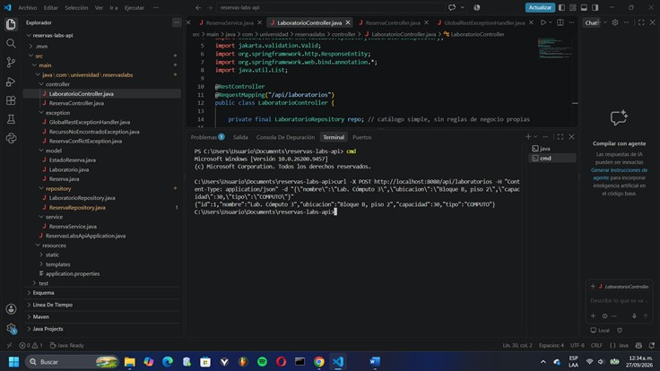
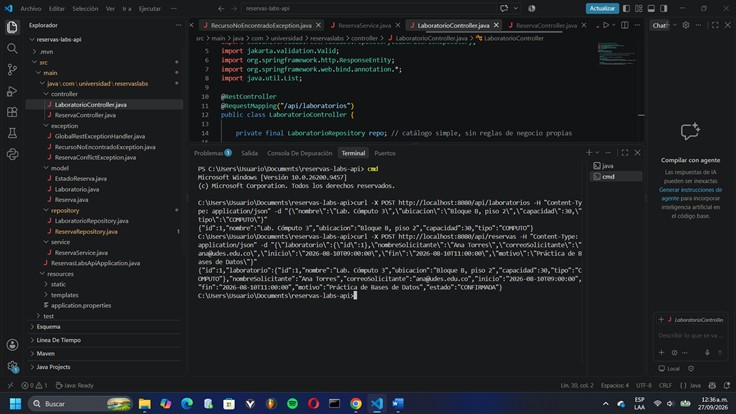
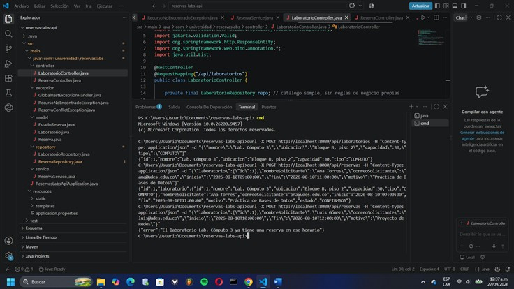
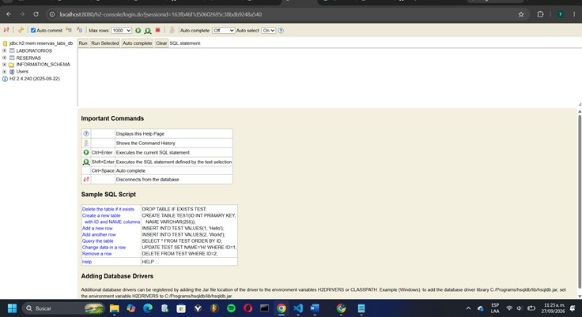
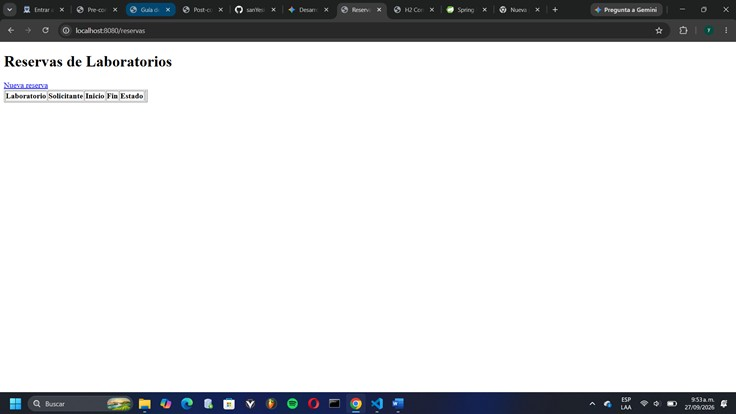
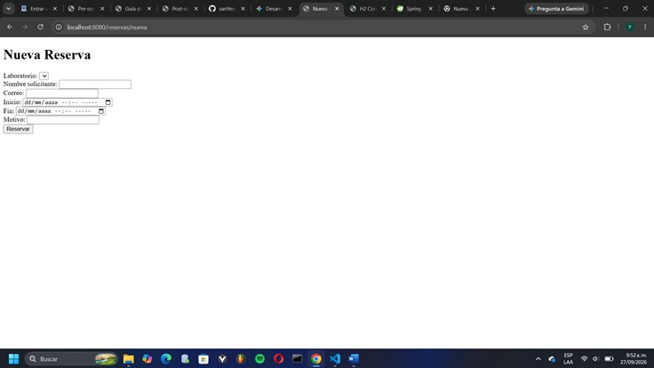
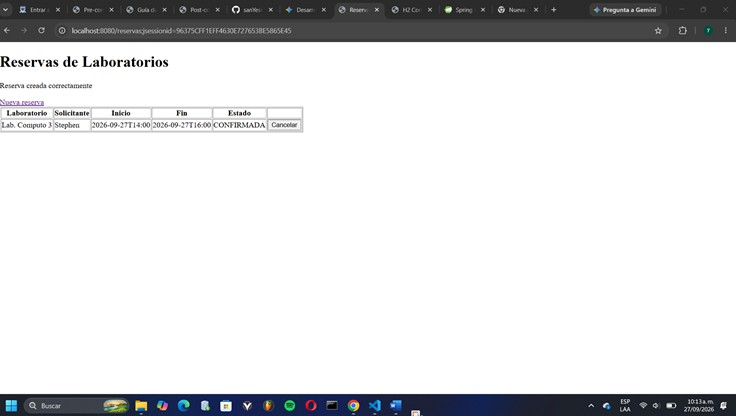
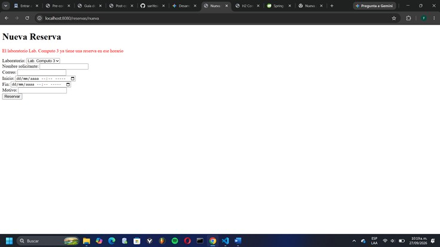

# Post-contenido — Unidad 5: Integración en Aplicaciones Web

## Descripción
Repositorio del post-contenido de la Unidad 5 de Patrones de Diseño
de Software. Un único proyecto Spring Boot (reservas-labs-api) para
la reserva de laboratorios de cómputo, con dos partes: una API REST
en capas (Entity, Repository, Service, Controller) sobre H2, y una
vista Thymeleaf (MVC clásico) que reutiliza el mismo Service.

## Parte 1 — Repository, Service y Controller REST
LaboratorioRepository y ReservaRepository extienden JpaRepository;
ReservaRepository agrega una consulta JPQL propia para detectar
solapamientos de horario. ReservaService concentra las reglas de
negocio (solapamiento, horario de atención, duración, cancelación
tardía). ReservaController y LaboratorioController exponen
/api/reservas y /api/laboratorios. Ver paquetes model/, repository/,
service/, exception/ y controller/.

## Parte 2 — Vista MVC con Thymeleaf
ReservaWebController expone /reservas con Thymeleaf, inyectando la
MISMA instancia de ReservaService que usa la API REST — sin Service
duplicado. ReservaWebExceptionHandler maneja las mismas excepciones
de dominio que GlobalRestExceptionHandler, con presentación distinta
(redirección con mensaje en vez de JSON). Ver paquete web/ y
templates/reservas/.


## Cómo ejecutar
```
$ mvn clean package
$ mvn spring-boot:run
```
API REST: http://localhost:8080/api/reservas
Vista MVC: http://localhost:8080/reservas

## Decisiones de diseño

### Punto de decisión 1 — Ubicación de la validación de solapamiento
Para detectar si una nueva reserva se solapa con una reserva activa existente del mismo laboratorio, existían dos alternativas: (a) traer a memoria todas las reservas del laboratorio con findByLaboratorioId y comparar los rangos de fecha con lógica Java pura dentro del Service, o (b) delegar el filtrado a una consulta JPQL en el Repository (buscarSolapamientos) que resuelve la comparación de rangos directamente en la base de datos.   

Se optó por la segunda alternativa. La razón es de rendimiento y escalabilidad: la cantidad de reservas históricas de un laboratorio crece indefinidamente con el tiempo, mientras que las reservas que realmente pueden solaparse con un rango dado son solo las que caen cerca de ese rango. Traer todo el historial a memoria para filtrarlo en Java es un trabajo que crece sin límite y que la base de datos ya sabe resolver de forma eficiente con un índice sobre laboratorio_id, inicio y fin.    

Sin embargo, es importante distinguir qué responsabilidad quedó en cada capa: el Repository solo responde una pregunta de datos ("¿qué reservas se solapan con este rango de tiempo?"), no toma ninguna decisión de negocio. Es ReservaService quien interpreta ese resultado y decide si la reserva se permite o no, lanzando ReservaConflictException con un mensaje claro cuando corresponde. Si el Controller llamara directamente a buscarSolapamientos() sin pasar por el Service, la API dejaría de aplicar la regla de negocio: devolvería la lista de conflictos, pero nada impediría que igualmente se guardara la reserva solapada, porque la decisión de rechazarla vive únicamente en ReservaService.crear(). Es decir, se perdería la garantía de integridad de la regla de negocio, que quedaría a criterio de cada consumidor del Repository en lugar de estar centralizada en un solo lugar.   


### Punto de decisión 2 — Reglas con y sin apoyo del Repository   

No todas las reglas de negocio de ReservaService necesitan acceso a la base de datos. La validación de horario de atención (07:00–21:00) y de duración permitida (30 minutos a 3 horas), implementada en validarHorarioYDuracion, depende exclusivamente de los campos inicio y fin del propio objeto Reserva que se está creando; no requiere comparar contra ninguna otra fila de la tabla reservas ni de ninguna otra tabla. Por eso esta regla se implementó enteramente en el Service con Java puro (cálculo de Duration y comparación de LocalTime), sin tocar el Repository ni generar ninguna consulta SQL.

El criterio general que separa ambos tipos de regla es el siguiente: si la regla necesita comparar el objeto contra datos que solo la base de datos conoce —como la existencia de otras reservas activas en un rango de tiempo—, conviene apoyarse en una consulta específica del Repository, porque intentar resolverlo solo con el objeto en memoria implicaría, de todos modos, tener que consultar esos otros datos. En cambio, si la regla solo depende de los propios atributos del objeto que se está validando, involucrar al Repository o a la base de datos no aporta nada: solo agregaría una consulta innecesaria y acoplaría una validación puramente de dominio a la capa de persistencia. Aplicar este criterio de forma consistente es, además, lo que evita que ReservaService se convierta en un Service anémico: cada regla vive en el lugar que le corresponde según qué datos necesita para evaluarse, no según una plantilla mecánica de "todo pasa por el Repository" o "todo se valida en el Service".   


### Punto de decisión 3 — Cómo comparten Service el Controller MVC y el REST

Tanto ReservaController (API REST) como ReservaWebController (vista MVC con Thymeleaf) reciben por inyección de dependencias la misma instancia de ReservaService, gestionada por Spring como bean singleton. La razón es que la lógica de negocio —validación de horario de atención, duración permitida y verificación de solapamientos— pertenece exclusivamente al dominio de la aplicación, mientras que los controladores solo cumplen el rol de adaptadores de entrada: transforman una petición (HTTP/JSON o un formulario HTML) en una invocación del Service, y adaptan el resultado o las excepciones al formato de salida correspondiente.

La alternativa descartada era duplicar las validaciones dentro de ReservaWebController, o crear una clase paralela como ReservaWebService casi idéntica a ReservaService. Esto habría violado tanto el principio DRY como el de responsabilidad única: si en el futuro cambiara una regla de negocio —por ejemplo, ampliar la duración máxima de reserva a 4 horas—, habría que modificarla en dos lugares distintos, con el riesgo real de que la vista Thymeleaf y la API REST terminaran aceptando reservas bajo reglas distintas y quedaran desincronizadas entre sí. Inyectar la misma clase en ambos controladores garantiza que exista una sola fuente de verdad para las reglas de negocio del sistema.

La inyección puede verificarse directamente en el constructor de cada controlador:

// ReservaController.java       
public ReservaController(ReservaService service) { this.service = service; }     

// ReservaWebController.java         
public ReservaWebController(ReservaService service, LaboratorioRepository laboratorioRepo) {      
    this.service = service;     
    this.laboratorioRepo = laboratorioRepo;     
}    

Ambos constructores reciben el mismo tipo ReservaService, y como esta clase está anotada con @Service, Spring inyecta la misma instancia en los dos controladores sin necesidad de configuración adicional.


### Punto de decisión 4 — Manejo de errores consistente entre MVC y REST

Se optó por mantener dos manejadores de excepciones independientes en la capa de presentación —GlobalRestExceptionHandler, restringido a los controladores REST mediante annotations = RestController.class, y ReservaWebExceptionHandler, restringido a ReservaWebController mediante assignableTypes = ReservaWebController.class— en lugar de uno solo. Ambos, sin embargo, consumen exactamente el mismo vocabulario de excepciones de dominio: ReservaConflictException y RecursoNoEncontradoException. Esto es posible porque la arquitectura en capas separa la lógica de negocio (qué error ocurrió) de su representación (cómo se muestra al cliente), y cada superficie de la aplicación necesita una representación distinta ante el mismo error:     

la API REST debe responder un cuerpo JSON con el código de estado HTTP correspondiente (409 Conflict, 404 Not Found, 400 Bad Request);
la vista MVC necesita una redirección (302) que conserve el mensaje mediante flash attributes, para mostrarlo como texto legible en una página HTML.

La alternativa descartada era unificar ambos casos en un único @RestControllerAdvice que inspeccionara la cabecera Accept de la petición para decidir si responder JSON o redirigir. Esto habría introducido una rama condicional por cada tipo de excepción, violando el principio de responsabilidad única y el principio abierto/cerrado: cualquier cambio en cómo se presenta un error en la vista MVC obligaría a tocar la misma clase que atiende a los clientes REST, aumentando el acoplamiento entre dos superficies que deberían poder evolucionar de forma independiente. Mantener dos manejadores explícitamente delimitados conserva la misma separación de responsabilidades que ya existe en el resto del proyecto: una clase por superficie de presentación, ambas alimentadas por el mismo vocabulario de excepciones de dominio.

## Herramientas utilizadas
- Java 17, Spring Boot 3.2, Spring Data JPA, H2, Thymeleaf
- Apache Maven, Postman/curl, Git, GitHub

## Conclusiones
El aprendizaje más relevante de este post-contenido fue entender que la separación en capas no es una plantilla mecánica que se aplica igual en todos los casos, sino un criterio que depende de qué necesita cada regla para evaluarse: si requiere datos que solo la base de datos conoce (como el solapamiento de horarios) o si le basta con los atributos del propio objeto (como la validación de horario y duración). Precisamente ahí estuvo la parte más difícil de decidir en la Parte 1, porque es tentador resolver todo trayendo datos a memoria y validando con Java puro, cuando en realidad delegar el filtrado de solapamientos al Repository resulta más eficiente y escalable a largo plazo. En la Parte 2, el reto principal fue evitar duplicar la lógica de negocio al agregar la vista MVC: reutilizar la misma instancia de ReservaService en ambos controladores dejó claro por qué la capa Service existe como punto único de verdad, y no como una capa intermedia sin propósito. De igual forma, separar el manejo de errores en dos clases —una para REST y otra para MVC— permitió comprobar que dos superficies de presentación pueden compartir exactamente el mismo vocabulario de excepciones de dominio sin acoplar su forma de responder al cliente. En conjunto, el ejercicio reforzó que justificar por escrito una decisión arquitectónica es tan importante como que el código funcione, porque obliga a pensar explícitamente en las consecuencias de la alternativa que se descartó.


## Evidencia visual

### Endpoints REST:

**endpoint POST /api/reservas retorna 201 Created con la reserva creada al enviar un horario libre**   


**endpoint POST /api/reservas retorna 409 Conflict con un mensaje descriptivo al intentar reservar un laboratorio en un horario que se solapa con una reserva activa existente**    


**endpoint POST /api/reservas retorna 400 Bad Request al enviar una reserva fuera del horario de atención o con una duración fuera del rango permitido**    


### consola H2



**Página de lista de reservas:**


**Formulario de nueva reserva :**


**Reserva creada exitosamente:**


**Error de solapamiento de horario :**

